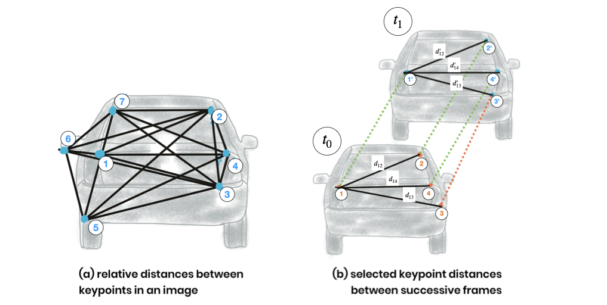

# Project Report

## Table of Contents
- [FP.0 Final Report](#fp0-final-report)
- [FP.1 Match 3D Objects](#fp1-match-3d-objects)
- [FP.2 Compute Lidar-based TTC](#fp2-compute-lidar-based-ttc)
- [FP.3 Associate Keypoint Correspondences with Bounding Boxes](#fp3-associate-keypoint-correspondences-with-bounding-boxes)
- [FP.4 Compute Camera-based TTC](#fp4-compute-camera-based-ttc)
- [FP.5 Performance Evaluation 1](#fp5-performance-evaluation-1)
- [FP.6 Performance Evaluation 2](#fp6-performance-evaluation-2)
    - [File Links](#file-links)
    - [SEL_NN Detector_Descriptor Combination plots](#sel_nn-detector_descriptor-combination-plots)
    - [SEL_KNN Detector_Descriptor Combination plots](#sel_knn-detector_descriptor-combination-plots)

### FP.0 Final Report
This readme serves as the writeup for the project.

### FP.1 Match 3D Objects
- `line 322` ( camFusion_Student.cpp)
- Associate keypoints with bounding boxes.
- Record associations between current and previous bounding boxes.
- Determine the best match for each current bounding box.
- Create a multimap to track box associations.
- Utilize keypoint matches to establish box correspondences.

### FP.2 Compute Lidar-based TTC
- `line 265` ( camFusion_Student.cpp)
- Calculate the Time-to-Collision (TTC) using Lidar data.
- Remove Lidar points outside the ego lane.
- Find the median x-coordinate in current and previous frames.
- Apply the constant velocity model for TTC estimation.
- Account for the time interval between frames.

<table>
  <tr>
    <td align="center">Overview</td>
    <td align="center">Calculation</td>
  </tr>
  <tr>
    <td align="left"></td>
    <td align="left"></td>
  </tr>
</table>

### FP.3 Associate Keypoint Correspondences with Bounding Boxes
- `line 154` ( camFusion_Student.cpp)
- Associate keypoints from the current frame with bounding boxes.
- Calculate the Euclidean distances between keypoints.
- Filter out outliers based on distance thresholds.
- Determine suitable distance thresholds (mean or median).
- Improve accuracy by considering the ego lane width.
<tr>
<td align="center"></td>
</tr>

### FP.4 Compute Camera-based TTC
- `line 212` ( camFusion_Student.cpp)
- Compute distance ratios between matched keypoints.
- Calculate the median distance ratio to reduce outliers' impact.
- Use frame rate to estimate the Time-to-Collision (TTC).
- Avoid division by zero with a minimum required distance.
- Output the TTC based on keypoint correspondences.

<table>
  <tr>
    <td align="center">Overview</td>
    <td align="center">Calculation</td>
  </tr>
  <tr>
    <td align="left"></td>
    <td align="left"></td>
  </tr>
</table>

### FP.5 Performance Evaluation 1

As the first step, I utilized the logged CSV file to identify cases of discrepancies and implausible measurements using pandas dataframes.

---

The table below presents specific instances where discrepancies in Time-to-Collision (TTC) estimates were observed:

| Detector Type | Descriptor Type | Matcher Type | Descriptor Type (BIN/HOG) | Selector Type | Image Index | TTC Lidar (s) | TTC Camera (s) |
|---------------|-----------------|--------------|---------------------------|---------------|-------------|---------------|----------------|
| SHITOMASI     | BRISK           | MAT_BF       | DES_BINARY                | SEL_NN        | 10          | 11.1746       | 35.585         |
| HARRIS        | BRISK           | MAT_BF       | DES_BINARY                | SEL_NN        | 5           | 15.7465       | 44.9166        |
| HARRIS        | BRISK           | MAT_BF       | DES_BINARY                | SEL_NN        | 10          | 11.1746       | -153.93        |

---

The extreme negative value for ttcCamera and a large difference of seconds compared to ttcLidar highlight a potential error in either the Lidar or camera-based TTC calculation, or both.

after knowing these problematic combinations, Following visuals are observed. by setting the visualization flags.

- SHITOMASI - BRISK problem case
<tr>
<td align="center"></td>
</tr>

- HARRIS - BRISK problem case

<tr>
<td align="center"></td>
</tr>

- FAST - ORB perfect case

<tr>
<td align="center"></td>
</tr>

**Likely factors | causes of discrepancy:**

1. **Algorithmic Limitations:**
   - The algorithms processing Lidar data might not effectively handle real-world variables like noise, sudden speed changes, contributing to erratic TTC estimates.
   - Camera data processing for TTC involves keypoint detection and description and matching from 2D images, prone to inaccuracies.

2. **Sensor Inaccuracies:**
   - Camera-based TTC relies on feature tracking in 2D images, which can be affected by lighting, occlusions, and motion blur.
   - Lidar sensors may be influenced by environmental conditions and target reflectivity, leading to distance measurement errors.

3. **Data Fusion Challenges:**
   - Synchronization and alignment discrepancies between Lidar and camera data can lead to significant differences in TTC calculations.

These factors collectively contribute to the variance in Lidar and camera-based TTC estimates, underscoring the need for robust sensor fusion and algorithmic refinement in TTC calculation systems.

### FP.6 Performance Evaluation 2
- `line 353` ( FinalProject_Camera.cpp )
For performance evaluation, all combinations of detectors and descriptors from project 2 were tested with both selector types, SEL_NN and SEL_KNN. TTC values for both camera and Lidar were logged along with image indices.

To run the evaluation, use the following commands:
- Run with default settings: `./3D_object_tracking`
- Specify detector and descriptor types: `./3D_object_tracking SHITOMASI BRISK MAT_BF DES_BINARY SEL_NN`
- Run all combinations with MAT_BF and SEL_NN: `./3D_object_tracking all`

Please note that DES_HOG will be selected for SIFT and AKAZE descriptors.

### File Links
- Logged files & matplotlib plots: [Link](https://drive.google.com/drive/folders/18pbcUIX81VOwaKAjsKxk3o3ta5fOJlJw?usp=sharing)
- Google Sheet (Consolidation of the raw data): [Link](https://docs.google.com/spreadsheets/d/1mIgZRGVAwiFfAWxsdUurBBcCHggUwDdHSfZpunv9tgE/edit?usp=sharing)

Based on the statistics, the minimum variation between the mean TTC values from camera and Lidar data was observed. The following combinations are recommended for SEL_NN selectorType:

**SIFT Detector with FREAK Descriptor:**
- Mean TTC Lidar: 10.80 seconds
- Mean TTC Camera: 10.85 seconds
- Difference: 0.05 seconds

**SIFT Detector with BRIEF Descriptor:**
- Mean TTC Lidar: 10.80 seconds
- Mean TTC Camera: 10.53 seconds
- Difference: 0.27 seconds

**SHITOMASI Detector with ORB Descriptor:**
- Mean TTC Lidar: 11.00 seconds
- Mean TTC Camera: 11.37 seconds
- Difference: 0.38 seconds

Please note that extreme outliers like -inf were observed in some cases, likely due to rare instances of concentrated outliers. Further examination is required to address these outliers.
### SEL_NN Detector_Descriptor Combination plots

**SelectorType: SEL_NN**
 

### SEL_KNN Detector_Descriptor Combination plots

**SelectorType: SEL_KNN**

*Figure: TTC comparison for SEL_NN and SEL_KNN selectorTypes.*

---

This project report summarizes the implementation and evaluation of Time-to-Collision (TTC) estimation algorithms using Lidar and camera data. The recommended detector and descriptor combinations provide reasonable TTC estimations, and further analysis is needed to address outliers in certain combinations of detector/descriptors.
