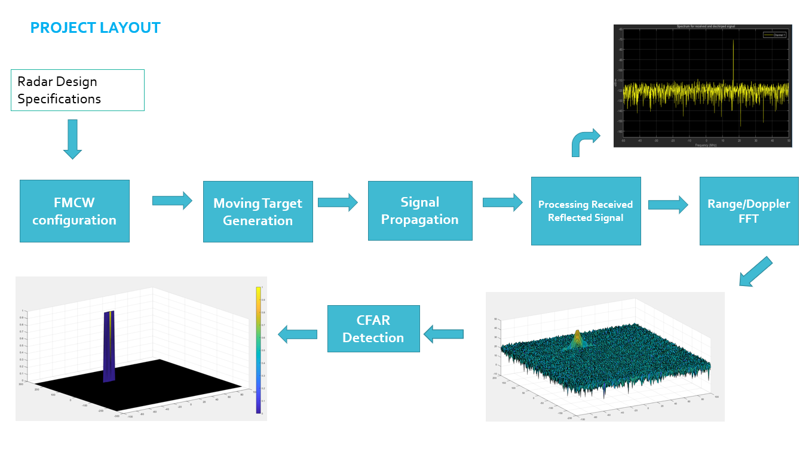
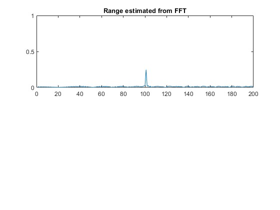

## Project: Radar Target Generation and Detection

### FMCW Waveform Design

**Specification:**
- Calculated slope should be approximately 2e13.
---

    RangeMax = 200;
    RangeResolution = 1;
    VelocityMax = 70;
    VelocityResolution = 3;
    c = 3e8;

    % Initial position and velocity of the Target

    R0_target = 100;
    V0_target = 20;

**Calculated Slope:** 
- Slope = 2.05e+13 Hz/s

### Simulation Loop

**Specification:**
- Generate a beat signal to accurately determine target range within +/- 10 meters.

- Lines 74-97 in the script.

### Range FFT (1st FFT)
**Specification:**
- The peak should indicate the correct range with an error margin of +/- 10 meters.

**Implementation Details:**
- Lines 99-137 in the script, output plot is shown below.

### 2D CFAR
**Specification:**
- 2D CFAR should suppress noise and clearly separate target signal, matching the walkthrough image.

#### Implementation Steps for 2D CFAR:
- Lines 169-259 in the script.
1. Initialize `CFAR` as a zero matrix sized as RDM.
2. Slide window across RDM, excluding Training and Guard Cells.
3. Compute noise level from training cells and determine threshold.
4. Compare CUT signal with the threshold.
5. Mark target presence in `CFAR`.

#### Parameter Selection:
- **Training Cells (Tr, Td)** and **Guard Cells (Gr, Gd)** are chosen as recommended in the [lesson](https://www.youtube.com/watch?v=DIVmHps0G8M), proving effective.
- **Offset** set to 1.3, optimized through experiments.

#### Edge Suppression:
- Zero out non-thresholded edge cells to maintain the size of the RDM.

#### Range-Doppler Map
Range-Doppler Map for this implementation is shown below.

#### CFAR-Output
CFAR output for this implementation is shown below.

